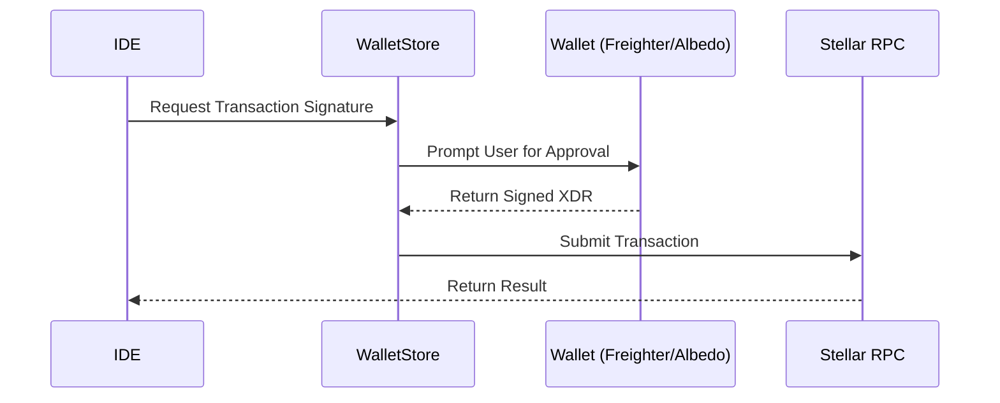
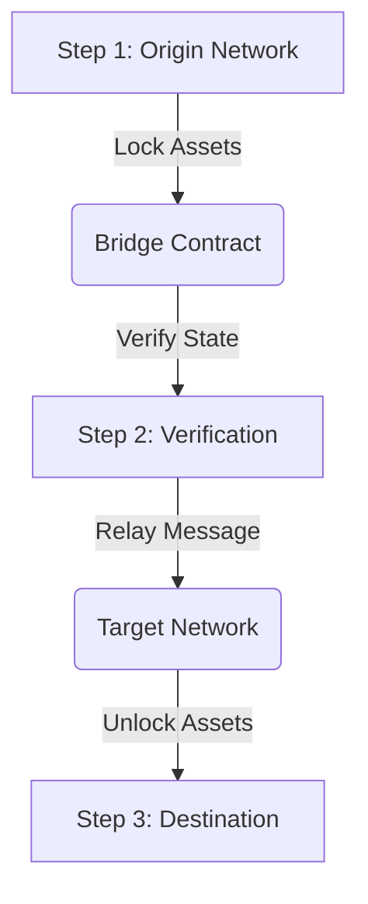
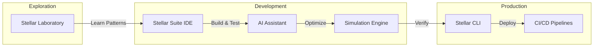

# Stellar Ecosystem Integration Guide

Stellar Suite IDE is designed to be the central hub for your Stellar and Soroban development journey. This guide documents how the IDE integrates with other tools, services, and wallets to provide a unified developer experience.

## 1. Wallet Integration (Freighter & Albedo)

The IDE integrates directly with popular Stellar wallets for secure transaction signing and account management. This allows you to build and test applications using your actual development accounts.

### 1.1 Connecting Your Wallet
The **Wallet Modal** (`ide/src/components/WalletModal.tsx`) allows you to connect via:
- **Freighter:** The standard browser extension for Stellar.
- **Albedo:** A browser-based signer that doesn't require an extension.

### 1.2 Signing Workflow
When you trigger a transaction (e.g., a contract invocation or asset payment), the IDE follows this flow:



## 2. Cross-Chain Asset Bridging (Bridge Wizard)

The **Bridge Wizard** (`ide/src/components/bridge/BridgeWizard.tsx`) provides a "Dry-Run" simulation environment for cross-chain asset movements.

### 2.1 The Bridge Workflow
The IDE visualizes the complex multi-step process of moving assets between Stellar and other chains:



**Key Features of the Bridge Wizard:**
- **Dry-Run Simulation:** Test the logic of your bridge interactions without real assets.
- **Security Checkpoints:** Visualizes signature verification, rate limits, and network availability checks.
- **Message Visualizer:** Real-time visualization of cross-chain message passing.

## 3. Environment Synchronization & Secret Sharing

### 3.1 Workspace State Sync
The IDE automatically syncs workspace state, including:
- **Last Used Contract IDs:** Stored in the workspace state and suggested during simulations.
- **RPC Endpoints:** Configurable via settings and shared across all IDE panels.
- **CLI Profiles:** If using a local environment, the IDE can resolve identities and networks from your `stellar-cli` configuration.

### 3.2 Secret Management Best Practices
For multi-tool environments (e.g., using the IDE alongside a CI/CD pipeline):
- **Avoid hardcoding secrets:** Use `.env` files which are excluded from version control.
- **Wallet-first signing:** Prefer using Freighter/Albedo for signing transactions rather than storing private keys in the IDE's environment variables.

## 4. The Stellar Developer Journey Map

The IDE is designed to follow you through every stage of your project's lifecycle:



## 5. Multi-Tool Setup Guide

To get the most out of the Stellar ecosystem, we recommend the following setup:
1. **IDE (Stellar Suite):** For daily coding, visual debugging, and AI-assisted building.
2. **Wallets (Freighter):** For managing your developer identities securely.
3. **CLI (Stellar CLI):** For advanced contract lifecycle management and production deployments.
4. **Laboratory:** For quick on-chain exploration and XDR decoding.

---
**Verified Terminal Output:**
```bash
# Verify the presence of integration components
ls ide/src/components/ | Select-String -Pattern "Wallet|Bridge"
```
*Output:*
```text
WalletModal.tsx
bridge/BridgeWizard.tsx
bridge/BridgeVisualizer.tsx
```
